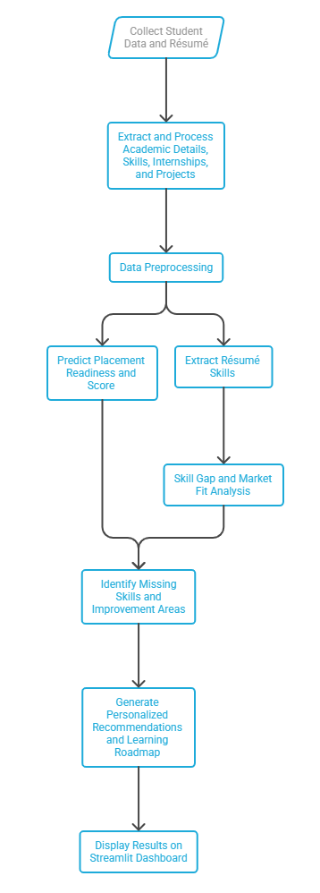
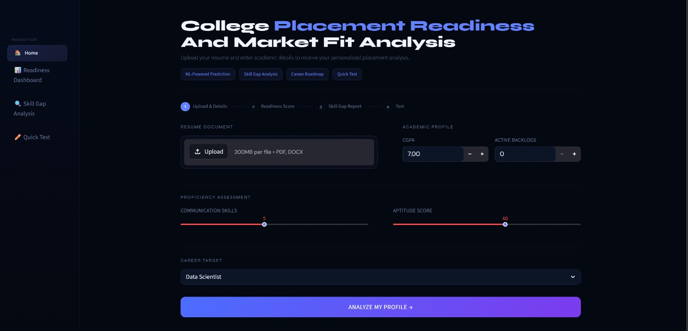
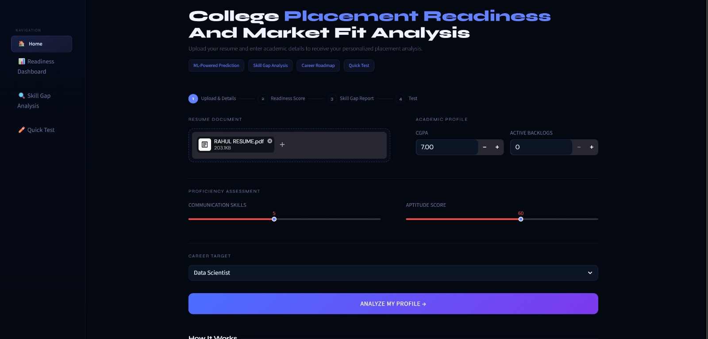
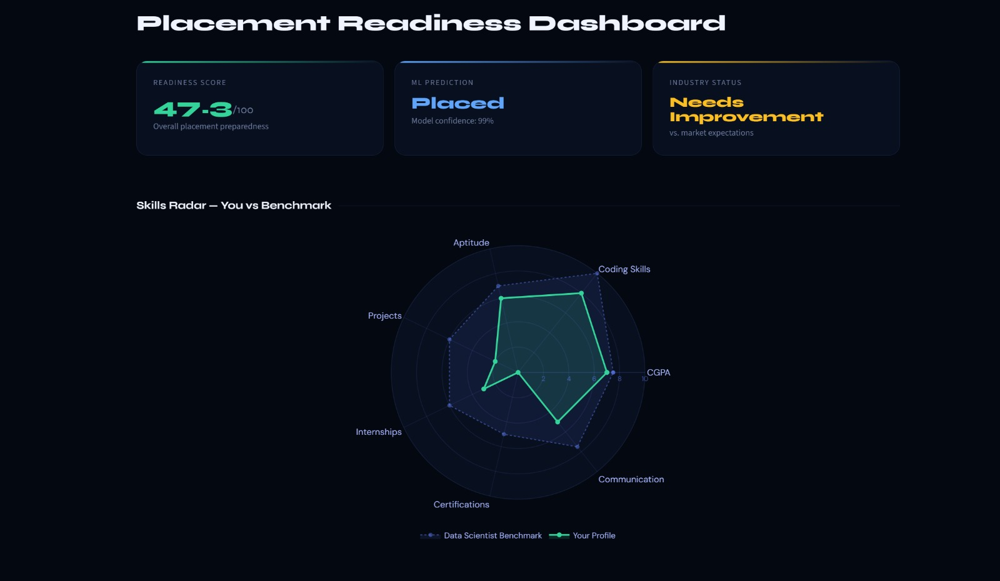
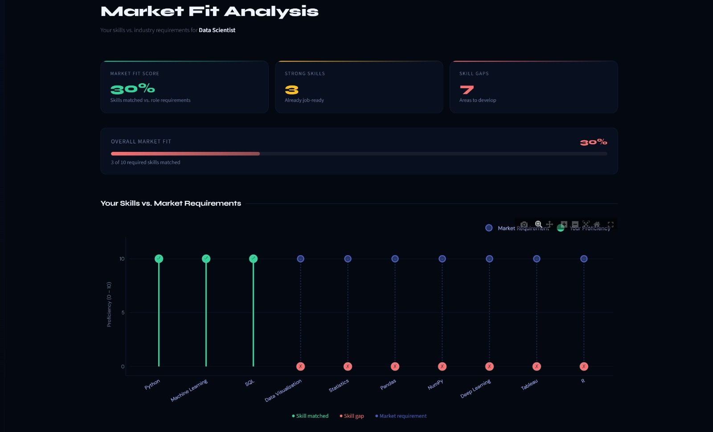
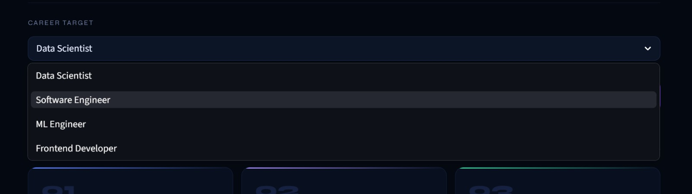
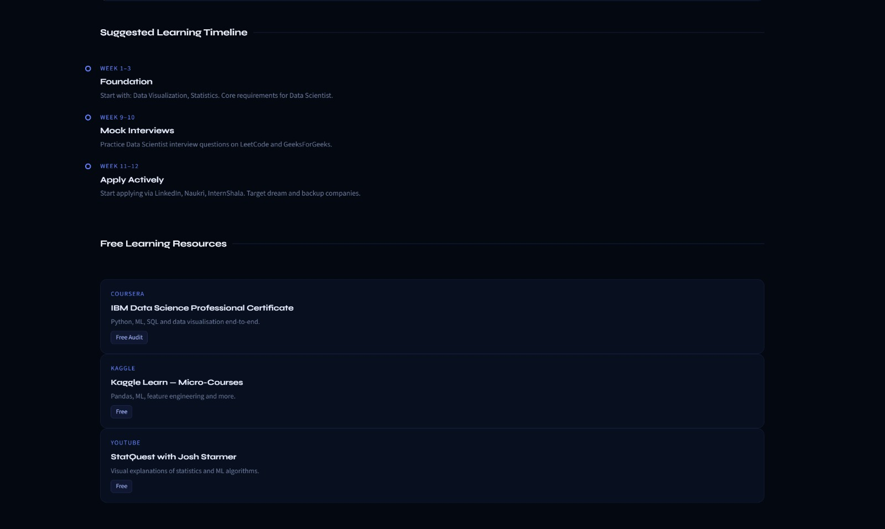

# College Placement Readiness & Market Fit Analysis

## 📌 Project Overview
- This project is a placement readiness prediction system that analyzes a student’s academic and skill profile to estimate their chances of getting placed. It uses an XGBoost machine learning model to predict placement outcomes The system also calculates a readiness score. Additionally, skill gap analysis and market fit evaluation. The project aims to help students understand their strengths and areas for improvement for better career preparation.
---

## 🚀 Features
- Placement Readiness Prediction
- Skill Gap Analysis
- Market Fit Evaluation
- Resume Upload System
- Interactive Dashboard

---

## 📊 Dataset

### 1. Student Dataset (Uploaded in Project)
- File: `college_placement_ds.csv`
- Description:
  This dataset contains student academic and skill-related information used for placement analysis.

- Key Features:
  - CGPA
  - Internships
  - Projects
  - Coding Skills
  - Communication Skills
  - Aptitude Test Score
  - Certifications
  - Backlogs
  - Placement Status

---

### 2. Job Dataset (External Source)
- Description:
  This dataset contains job descriptions and required skills used for market fit and skill gap analysis.

- Source:
  https://www.kaggle.com/datasets/ravindrasinghrana/job-description-dataset

- Note:
  Due to large file size, this dataset is not uploaded in the repository.
  It can be downloaded from the above link.

---

## ⚙️ Technologies Used
- Python
- Pandas
- Scikit-learn
- Streamlit

---

## 🔄 Preprocessing Steps
- Removed irrelevant columns
- Handled missing values
- Removed duplicates
- Cleaned text data
- Encoded categorical variables

---

## 🎯 Expected Outcomes

- Predict placement readiness score
- Identify skill gaps based on industry demand
- Evaluate market fit between student skills and job requirements
- Help students improve employability and placement chances

---

## Methodology

- Student data and résumé are collected through the Streamlit interface.
- Academic details, skills, internships, and projects are extracted and processed.
- Data preprocessing is performed to clean and normalize the dataset.
- The XGBoost model predicts placement readiness and generates a readiness score.
- Résumé skills are extracted using PDF/DOCX parsing techniques.
- Groq API with LLaMA 3.3 70B performs skill gap and market fit analysis.
- Missing skills and improvement areas are identified.
- Personalized recommendations and learning roadmap are generated.
- All results are displayed using an interactive Streamlit dashboard with charts and visualizations.
---

### Workflow 

  

---

# Results

The system generates placement readiness predictions, market fit analysis, and personalized recommendations through an interactive dashboard.

---

## 1. Home Dashboard

The home dashboard allows students to upload resumes, enter academic details, and select their target career role.

  

---

## 2. Resume Upload and Profile Input

Students can upload PDF/DOCX resumes and provide placement-related information.

  

---

## 3. Placement Readiness Dashboard

Displays:
- Readiness score
- Placement prediction
- Industry readiness comparison
- Radar chart analysis

  

---

## 4. Market Fit Analysis

The system compares student skills with industry-required skills and calculates market fit percentage.

  

---

## 5. Career Role Selection

Students can analyze their profile for different job roles such as:
- Data Scientist
- Software Engineer
- ML Engineer
- Frontend Developer

  

---

## 6. Personalized Suggestions

Provides improvement suggestions and career roadmap recommendations.

  

## 📌 Conclusion

This project bridges the gap between academic learning and industry expectations by combining data preprocessing, machine learning, and intelligent analysis.

It helps improve placement outcomes by identifying skill gaps, predicting readiness, and aligning student skills with market requirements.

---

